Multi-Agent Enterprise RAG Architecture

Kafka + Spark + Docling/OCR + Vector DB + LangGraph/ADK + Gemini/Vertex AI

This architecture is designed for enterprise-scale document analysis over huge document volumes: PDFs, scanned PDFs, DOCX, PPTX, TXT, images, contracts, RFPs, finance documents, HR policies, technical manuals, and mixed-layout documents.

The design is multi-agent, but not “LLM agent for everything.” The correct approach is:

Deterministic distributed systems for heavy processing+Specialized agents for orchestration and decisions+LLMs only for reasoning, hard enrichment, verification, and final answers

ADK is suitable for production-grade agent systems because its documentation describes it as an open-source framework for building, debugging, and deploying enterprise agents, with support for graph workflows, multi-agent workflows, model routing, Gemini, local models, observability, evaluation, and deployment to Cloud Run/GKE/Agent Runtime. LangChain gives the model/tool harness, LangGraph gives advanced orchestration with durable execution and human-in-the-loop support, and LangSmith provides tracing, debugging, and evaluation.

# 1. Whole Project Architecture

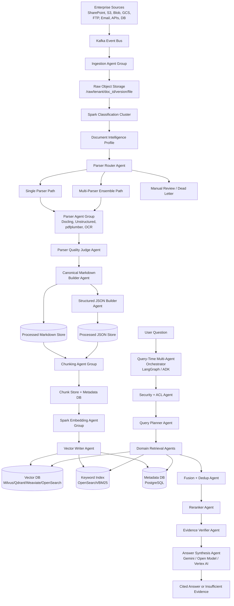

Figure 1. Complete Multi-Agent RAG System

# 2. Main Design Layers

| Layer | Purpose | Recommended Tools |
| --- | --- | --- |
| Event backbone | Move document events between services | Kafka |
| Distributed compute | High-speed batch/stream processing | Spark, Spark Structured Streaming |
| Document intelligence | Parse PDFs, DOCX, PPTX, OCR, tables, layout | Docling, Unstructured, pdfplumber, Tesseract, PaddleOCR |
| Agent orchestration | Multi-agent workflows and state transitions | LangGraph, Google ADK |
| Model/tool abstraction | LLM, tool, retriever interfaces | LangChain |
| Observability | Trace every agent/tool/model call | LangSmith, OpenTelemetry, Prometheus, Grafana |
| Storage | Raw files, markdown, JSON, metadata | Object storage, PostgreSQL, Iceberg/Delta |
| Search | Semantic + keyword retrieval | Milvus/Qdrant/Weaviate/OpenSearch |
| LLM reasoning | Query planning, enrichment, verification, answer | Gemini/Vertex AI, vLLM-hosted open models |

Spark is useful here because Spark’s Kafka integration supports parallelism, Kafka partition correspondence, and offset metadata access, which fits document-event processing. Docling is a strong parser base because it supports multiple formats, advanced PDF understanding, layout, reading order, table structure, OCR, Markdown/JSON export, and integrations with LangChain/LlamaIndex/CrewAI/Haystack/vector databases. Unstructured is useful as a complementary parser because it supports partitioning, cleaning, extracting, staging, chunking, embedding workflows, and document elements/metadata; however, its open-source library is better for prototyping than production unless you build the required scaling and governance around it.

# 3. Agent Catalog

| Agent Group | Main Responsibility |
| --- | --- |
| Ingestion Agent Group | Detect files, validate, checksum, version, store raw file, publish event |
| Classification Agent Group | Identify file type, OCR need, layout complexity, document category, risk |
| Parser Router Agent | Decide single parser, ensemble parser, OCR path, layout path, or manual review |
| Parser Agent Group | Run Docling, OCR, pdfplumber, Unstructured, layout-aware extraction |
| Parser Quality Judge Agent | Score parser outputs and decide best/merged result |
| Markdown Builder Agent | Create canonical LLM-ready markdown |
| JSON Builder Agent | Store machine-readable page/layout/table/image structure |
| Chunking Agent Group | Create structure-aware parent/child chunks |
| Embedding Agent Group | Choose embedding model and generate vectors at scale |
| Vector Writer Agent | Idempotently write vectors, metadata, ACLs, versions |
| Query Planner Agent | Convert user question into retrieval plan |
| Domain Retrieval Agents | Search contracts, RFP, finance, policies, technical docs, etc. |
| Fusion + Dedup Agent | Merge keyword/vector/domain results |
| Reranker Agent | Select best evidence chunks |
| Evidence Verifier Agent | Check claims, citations, ACLs, latest versions |
| Answer Synthesis Agent | Generate final answer from verified evidence |
| Audit/Observability Agent | Track lineage, traces, latency, cost, quality |

# 4. Ingestion Agent Group

## Purpose

This agent group receives file discovery events and prepares reliable raw-document records.

It should not parse the file yet. It only answers:

- Is this file valid?

- Is it new or duplicate?

- Where is it stored?

- Who can access it?

- What event should happen next?

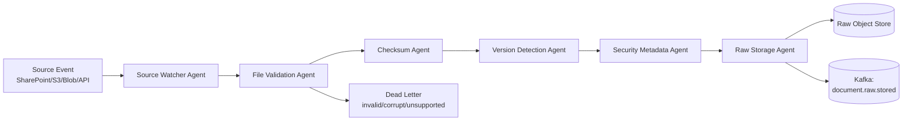

Figure 2. Ingestion Agent Architecture

## Workflow

# 1. Receive document.discovered event.

# 2. Validate extension, MIME type, file size, checksum.

# 3. Detect duplicate or new version.

# 4. Extract source metadata and ACL.

# 5. Store original file in raw object storage.

# 6. Publish document.raw.stored.

# 7. Send corrupted/encrypted/unsupported files to dead-letter/manual-review queue.

## Output Event

{ "event_type": "document.raw.stored", "document_id": "doc_789", "tenant_id": "company_a", "version": 4, "raw_file_uri": "s3://rag/raw/company_a/doc_789/v4/original.pdf", "checksum": "sha256:abc123", "security_acl": ["legal_team", "finance_team"]}

Kafka should carry metadata and object-storage pointers, not large file bytes. Kafka’s official documentation exposes key concepts, APIs, Connect, Streams, operations, and security as first-class areas, which supports this event-bus role.

# 5. Document Classification Agent Group

## Purpose

This is the first intelligence layer. It decides the document complexity before parsing.

It generates a Document Intelligence Profile.

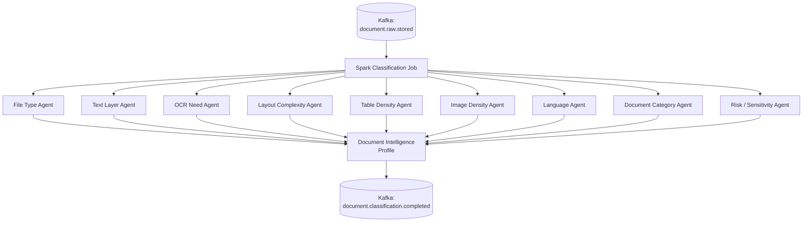

Figure 3. Classification Agent Architecture

## Workflow

# 1. Spark consumes document.raw.stored events.

# 2. Read file metadata and lightweight document signals.

# 3. Detect file type: PDF, DOCX, PPTX, TXT, image, email.

# 4. Detect digital text layer vs scanned content.

# 5. Estimate OCR need.

# 6. Estimate layout/table/image complexity.

# 7. Classify domain: contract, RFP, finance, HR, policy, technical.

# 8. Detect sensitivity: PII, PHI, PCI, confidential, legal hold.

# 9. Generate Document Intelligence Profile.

## Document Intelligence Profile

{ "document_id": "doc_789", "file_type": "pdf", "document_category": "contract", "text_density_score": 0.91, "ocr_required_score": 0.05, "table_density_score": 0.72, "image_density_score": 0.34, "layout_complexity_score": 0.68, "classification_confidence": 0.86, "recommended_path": "docling_plus_pdfplumber"}

# 6. Parser Router Agent

## Purpose

The Parser Router Agent chooses the right extraction path.

This is where your system becomes smarter than normal RAG.

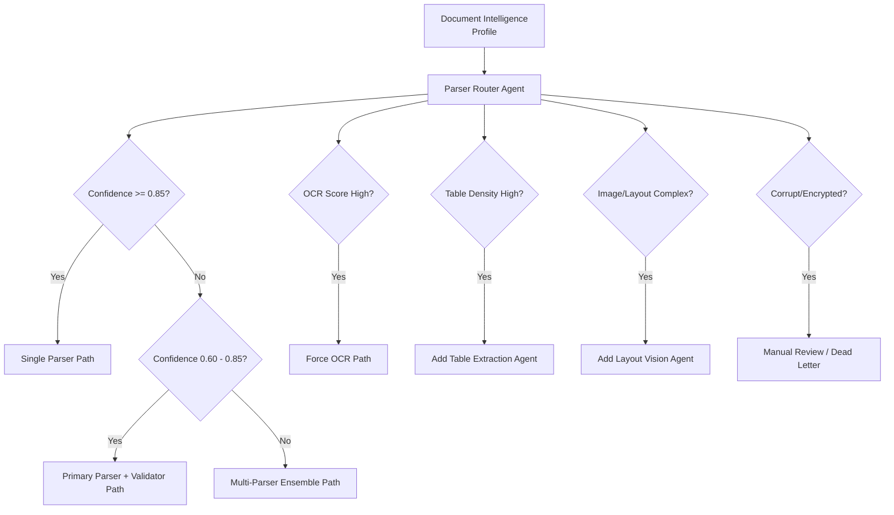

Figure 4. Parser Router Agent Architecture

## Routing Rules

classification_confidence >= 0.85 -> single parser0.60 <= classification_confidence < 0.85 -> primary parser + validator parserclassification_confidence < 0.60 -> multi-parser ensembleocr_required_score >= 0.70 -> OCR-first pathtable_density_score >= 0.60 -> add table extraction agentimage_density_score >= 0.60 or layout_complexity_score >= 0.70 -> add layout/image caption agentcorrupt/encrypted/password-protected -> manual review or dead letter

# 7. Parser Agent Group

## Purpose

This group extracts text, tables, images, layout, page numbers, bounding boxes, and metadata.

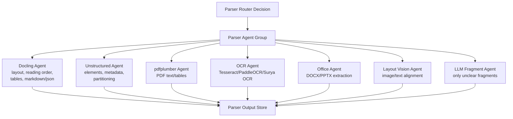

Figure 5. Parser Agent Group Architecture

## Tool Responsibility

| Agent | Best For |
| --- | --- |
| Docling Agent | Main document parser, layout, reading order, tables, Markdown/JSON |
| Unstructured Agent | Element extraction, quick parsing, alternate validation |
| pdfplumber Agent | PDF tables and exact text-region extraction |
| OCR Agent | Scanned pages, image text |
| Office Agent | DOCX/PPTX structure, slides, comments, notes |
| Layout Vision Agent | Images, diagrams, chart-text alignment |
| LLM Fragment Agent | Only hard fragments, not entire documents |

Docling’s feature list includes parsing for PDF/DOCX/PPTX/XLSX/HTML/images/plain text and advanced PDF understanding such as page layout, reading order, table structure, code, formulas, image classification, Markdown export, JSON export, OCR, VLM support, and local execution.

# 8. Multi-Parser Ensemble Agent

## Purpose

For difficult documents, do not trust one parser. Run multiple parsers, compare results, and merge the best pieces.

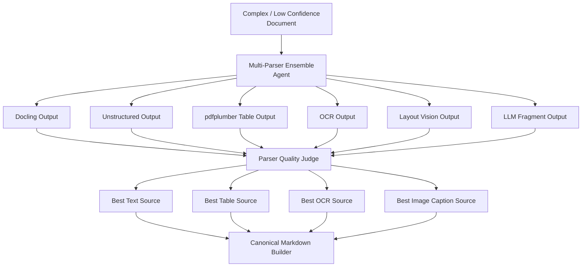

Figure 6. Multi-Parser Ensemble Architecture

## Quality Score

final_parse_score = 0.20 * text_coverage_score + 0.15 * reading_order_score + 0.15 * table_quality_score + 0.15 * layout_preservation_score + 0.10 * OCR_confidence_score + 0.10 * image_caption_coverage_score + 0.10 * metadata_completeness_score - 0.05 * duplicate_noise_score

## Important Rule

Do not run this expensive path for every document.

Simple document -> one parserMedium document -> primary parser + validatorComplex document -> parser ensembleCritical document -> parser ensemble + human review if confidence is low

# 9. Parser Quality Judge Agent

## Purpose

The quality judge decides whether the parser output is trustworthy.

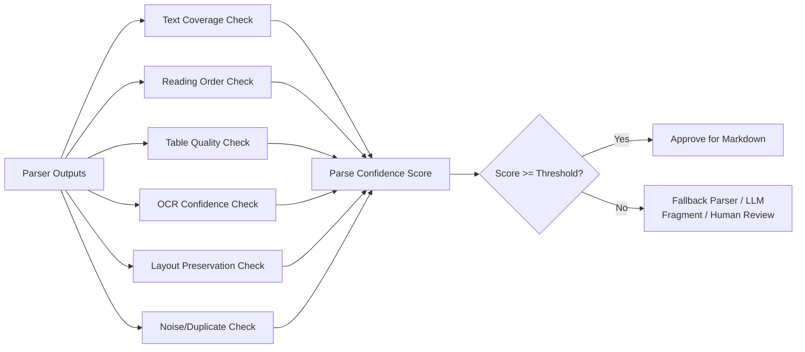

Figure 7. Parser Quality Judge Workflow

Output

{ "document_id": "doc_789", "best_text_source": "docling", "best_table_source": "pdfplumber", "best_ocr_source": "paddleocr", "parse_confidence": 0.92, "manual_review_required": false}

# 10. Canonical Markdown Builder Agent

## Purpose

This agent creates the final LLM-friendly document.

The markdown file becomes the trusted “clean document” used for chunking, audit, and citations.

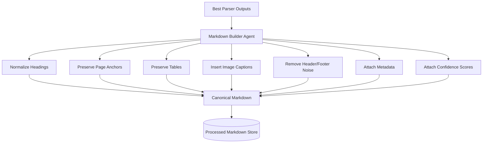

Figure 8. Markdown Builder Architecture

## Example Output

# Vendor ABC Master Services Agreementmetadata: document_id: doc_789 version: 4 document_type: contract parser_path: docling_plus_pdfplumber parse_confidence: 0.92 security_acl: - legal_team - finance_team---## Page 2: Payment TermsInvoices shall be paid within thirty calendar days after approval.### Table: Pricing Schedule| Service | Unit Cost | Billing Frequency ||---|---:|---|| Data Processing | 1200 | Monthly |## Page 5: Approval Workflow DiagramImage description:The diagram shows vendor invoice submission, legal approval, finance approval,and payment execution.

# 11. Structured JSON Builder Agent

## Purpose

Markdown is good for humans and LLMs. JSON is good for systems.

The JSON stores page coordinates, tables, image locations, confidence, and lineage.

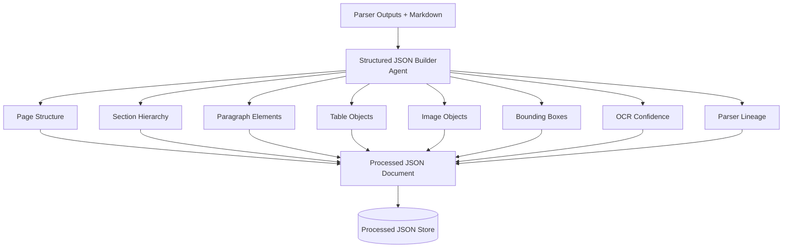

Figure 9. Structured JSON Builder Architecture

## JSON Example

{ "document_id": "doc_789", "version": 4, "sections": [ { "title": "Payment Terms", "page_start": 2, "page_end": 2, "elements": [ { "type": "paragraph", "text": "Invoices shall be paid within thirty calendar days after approval.", "bbox": [100, 250, 500, 290], "confidence": 0.96 } ] } ]}

# 12. Chunking Agent Group

## Purpose

Chunking should depend on document type.

A contract should not be chunked the same way as a PPTX or finance spreadsheet.

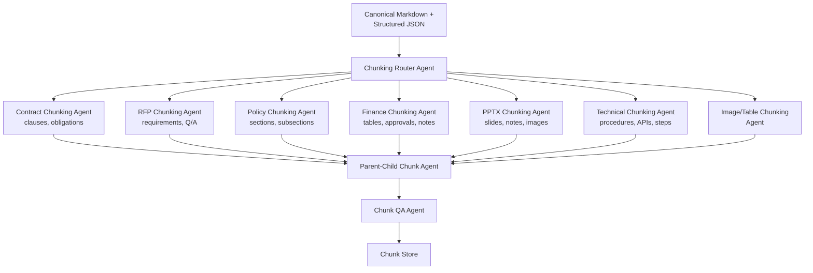

Figure 10. Chunking Agent Group Architecture

## Chunking Rules

| Document Type | Chunking Strategy |
| --- | --- |
| Contract | Clause + section parent chunks |
| RFP | Requirement/question/answer chunks |
| Policy | Heading/subheading chunks |
| PPTX | Slide parent + bullet/image child chunks |
| Finance | Table chunks + approval notes |
| Technical docs | Procedure/API/step chunks |
| Scanned PDF | Page/section chunks with OCR confidence |
| Image-heavy document | Image caption + nearby text chunk |

## Chunk Object

{ "chunk_id": "doc_789_v4_chunk_021", "document_id": "doc_789", "version": 4, "chunk_type": "contract_clause", "section_path": "Payment Terms > Invoice Approval", "page_start": 2, "page_end": 2, "text": "Invoices shall be paid within thirty calendar days after approval.", "parent_chunk_id": "doc_789_v4_section_payment_terms", "security_acl": ["legal_team", "finance_team"], "source_markdown_uri": "s3://processed_markdown/company_a/doc_789/v4/document.md"}

# 13. Embedding Agent Group

## Purpose

This group generates embeddings at scale using Spark.

It should not embed bad chunks, empty chunks, unauthorized chunks, or old versions incorrectly.

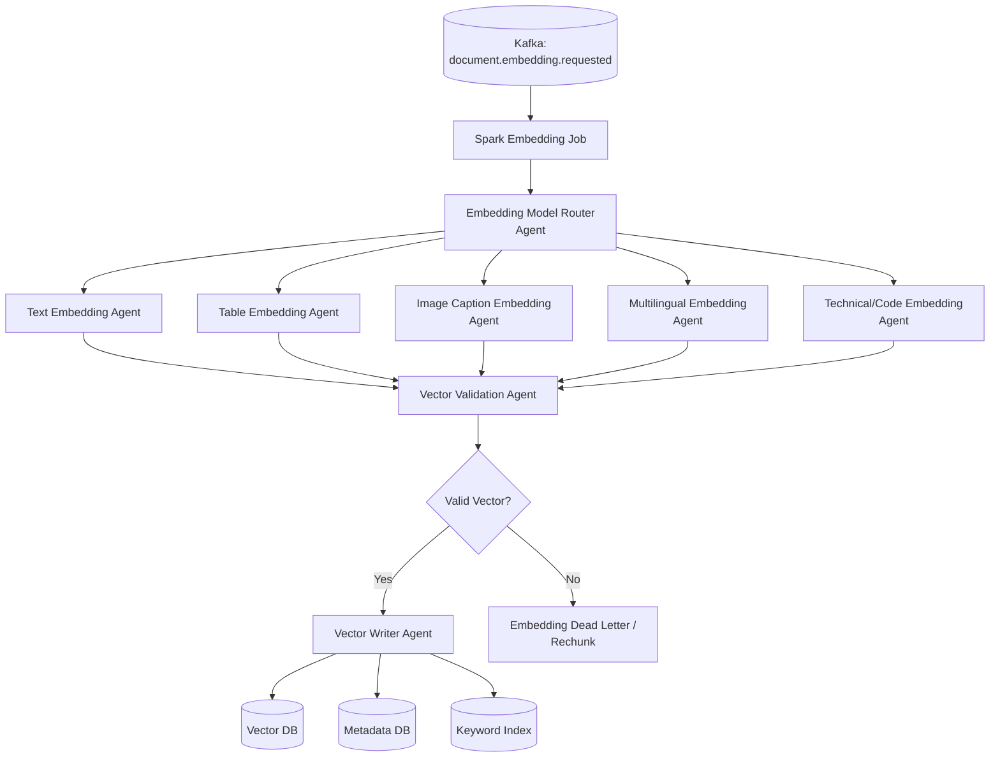

Figure 11. Embedding Agent Architecture

## Embedding Model Choices

| Chunk Type | Model Choice |
| --- | --- |
| Normal text | ModernBERT, BGE, E5, GTE |
| Long technical text | ModernBERT / long-context embedding |
| Multilingual text | BGE-M3, multilingual-E5, Gemini embeddings |
| Tables | table-to-text + table metadata embedding |
| Images | caption embedding, not raw image by default |
| Code | code-aware embedding |
| Low-confidence OCR | skip, review, or embed with confidence penalty |

# 14. Vector Writer Agent

## Purpose

The Vector Writer Agent writes vectors safely.

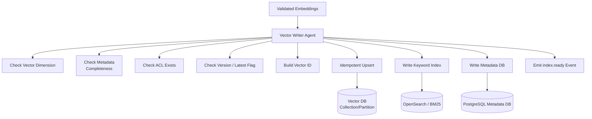

Figure 12. Vector Writer Architecture

Milvus is a strong enterprise vector DB option because its documentation describes open-source and distributed deployment modes, Kubernetes-based distributed deployment for billion-scale or larger scenarios, ANN search, filtering search, hybrid search, full-text BM25 search, and reranking.

# 15. Query-Time Multi-Agent Orchestration

## Purpose

This is the live user-question flow.

Use LangGraph or ADK here, not Spark.

Spark is for heavy background processing. Query-time retrieval needs low-latency orchestration.

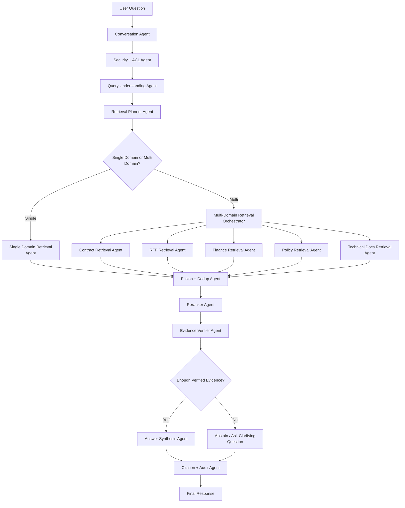

Figure 13. Query-Time Multi-Agent Architecture

# 16. Query Planner Agent

## Purpose

The Query Planner Agent converts the user’s question into a retrieval plan.

This is like Spark Catalyst, but for RAG retrieval.

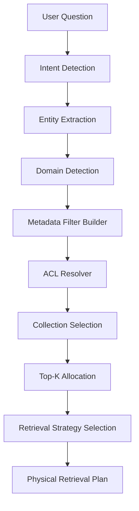

Figure 14. Query Planner Workflow

## Example Question

Compare Vendor ABC's RFP pricing requirement, signed contract payment terms,and finance approval notes.

## Logical Plan

{ "intent": "compare_documents", "domains": ["rfp", "contract", "finance"], "entities": { "vendor": "Vendor ABC" }, "required_evidence": [ "pricing requirement", "payment terms", "approval notes" ]}

## Physical Plan

{ "collections": [ "rfp_vectors", "contracts_vectors", "finance_vectors" ], "filters": { "tenant_id": "company_a", "vendor": "Vendor ABC", "latest_version": true, "security_acl": "resolved_user_acl" }, "retrieval_strategy": "hybrid", "top_k_per_collection": 50, "reranker": "cross_encoder_or_gemini_judge"}

# 17. Domain Retrieval Agents

## Purpose

Each domain retrieval agent understands one business domain.

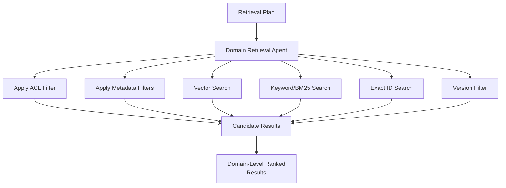

Figure 15. Domain Retrieval Agent Pattern

## Domain Agents

| Agent | Search Focus |
| --- | --- |
| Contract Retrieval Agent | Clauses, obligations, payment terms, signed version |
| RFP Retrieval Agent | Requirements, proposals, scoring, pricing |
| Finance Retrieval Agent | Approval notes, invoices, budgets, tables |
| HR Policy Retrieval Agent | HR rules, benefits, PTO, compliance |
| Legal Retrieval Agent | Legal memos, case references, contracts |
| Technical Docs Agent | APIs, architecture, SOPs, manuals |
| Security/Compliance Agent | Controls, policies, audit evidence |

# 18. Fusion + Dedup Agent

## Purpose

When multiple agents return results, this agent merges them.

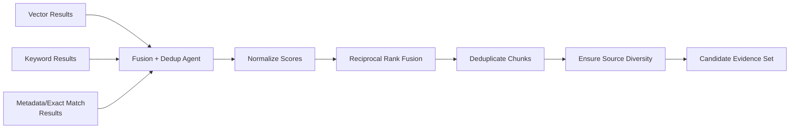

Figure 16. Fusion Agent Architecture

## Fusion Rules

# 1. Prefer chunks that match both semantic and keyword search.

# 2. Prefer exact entity matches.

# 3. Prefer latest version unless user asks historical.

# 4. Remove duplicate chunks from same page/section.

# 5. Keep source diversity across contracts, RFPs, finance docs.

# 6. Never include unauthorized chunks.

# 19. Reranker Agent

## Purpose

The Reranker Agent reduces many candidates to the best evidence.

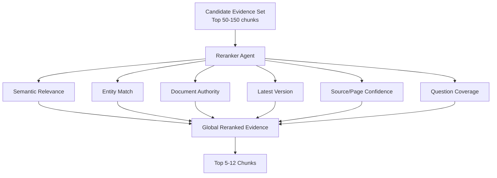

Figure 17. Reranker Agent Workflow

## Reranking Criteria

semantic relevanceexact vendor/document/entity matchlatest versiondocument authoritypage/section confidenceparse confidenceOCR confidencequestion coveragesource diversity

# 20. Evidence Verifier Agent

## Purpose

This is the trust layer.

The verifier checks whether the answer can be safely generated.

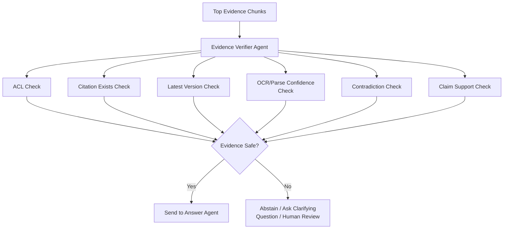

Figure 18. Evidence Verifier Architecture

## Verification Rules

Every claim must be supported by retrieved evidence.Every citation must map to a real document/page/section.The user must have access to every cited chunk.Old versions must not be used unless requested.Low-confidence OCR should be disclosed or excluded.Conflicting evidence should be surfaced, not hidden.

# 21. Answer Synthesis Agent

## Purpose

This agent writes the final answer using only verified context.

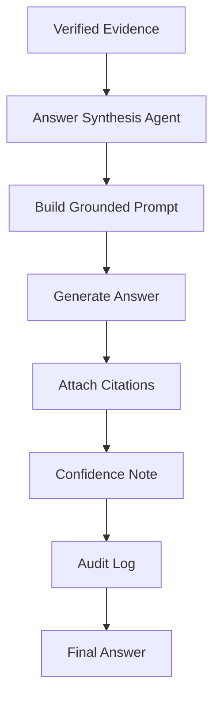

Figure 19. Answer Synthesis Agent Workflow

## Output Format

# 1. Answer:Vendor ABC's signed contract states that invoices are payable within thirtycalendar days after approval. The RFP pricing section required monthly billing,and the finance approval memo confirms monthly billing approval.Sources:

# 2. Vendor ABC MSA, Page 2, Payment Terms

# 3. RFP-2026-ABC, Page 14, Pricing Requirements

# 4. Finance Approval Memo, Page 3

Use Gemini/Vertex AI here when you need managed enterprise deployment, strong reasoning, multimodal understanding, and Gemini-native ADK integration. ADK documentation says it provides easy access to Gemini and can connect to other leading and locally running models, with Google Cloud deployment options for performance, reliability, security, access, safety, and cost management.

# 22. Observability and Audit Agent

## Purpose

Every agent call must be traceable.

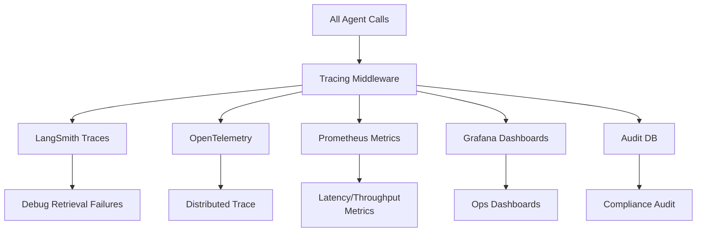

Figure 20. Observability Architecture

## Track:

agent nameinput/outputtool callsmodel usedlatencycostretrieved chunksreranked chunksverification resultcitationsuser feedbackfailure reason

LangSmith provides visibility from individual traces to production-wide metrics, supports framework/provider integrations, trace filtering/export, dashboards, alerts, automations, and feedback collection.

# 23. Storage Architecture

```mermaid
flowchart TB
  RAW["Raw Files"] --> ROS[("Raw Object Store")]
  MD["Canonical Markdown"] --> MDS[("Processed Markdown Store")]
  JSON["Structured JSON"] --> JSONS[("Processed JSON Store")]
  CHUNKS["Chunks"] --> CS[("Chunk Store<br/>PostgreSQL/Iceberg/Delta")]
  EMB["Embeddings"] --> VDB[("Vector DB")]
  TEXT["Exact Text"] --> BM25[("OpenSearch BM25")]
  META["Metadata / ACL / Lineage"] --> MDB[("Metadata DB")]
  AUDIT["Traces / Audits"] --> ADB[("Audit/Observability DB")]
```

Figure 21. Storage Architecture

## Store Responsibilities

| Store | Responsibility |
| --- | --- |
| Raw Object Store | Original untouched files |
| Markdown Store | Clean LLM-ready markdown |
| JSON Store | Machine-readable layout/table/page data |
| Chunk Store | Chunk objects before embedding |
| Vector DB | Semantic search |
| OpenSearch | Keyword, exact ID, BM25 search |
| Metadata DB | ACLs, versions, lineage, status |
| Audit DB | Traces, answer history, retrieved evidence |

# 24. Kafka Topic Architecture

```mermaid
flowchart LR
  D["document.discovered"] --> RAW["document.raw.stored"]
  RAW --> C["document.classification.completed"]
  C --> R["document.parser.route.selected"]
  R --> S["document.parsing.started"]
  S --> DONE["document.parsed.completed"]
  DONE --> MD["document.markdown.ready"]
  MD --> CH["document.chunked.completed"]
  CH --> EMB["document.embedding.completed"]
  EMB --> IDX["document.indexed.completed"]
  C -.-> DL["document.deadletter"]
```

Figure 22. Kafka Event Flow

## Kafka Event Rule

Use:

partition_key = tenant_id + document_id

This keeps events for the same document ordered while allowing huge parallelism across different documents.

Spark’s Kafka integration documentation discusses partition-to-partition parallelism, offsets, metadata, and offset storage choices; for production, vector writes and metadata updates should be idempotent and offsets should be committed only after output is safely stored.

# 25. Deployment Architecture

```mermaid
flowchart TB
  subgraph CLOUD["Kubernetes / Cloud Platform"]
    K["Kafka Cluster"] --> S["Spark Cluster"]
    S --> P["Parser Workers"]
    S --> E["Embedding Workers"]
    API["API Gateway"] --> Q["Query Orchestrator"]
    Q --> AG["Agent Services<br/>LangGraph/ADK"]
  end
  subgraph STORAGE["Storage"]
    OBJ[("Object Storage")]
    VDB[("Vector DB Cluster")]
    OS[("OpenSearch Cluster")]
    PG[("PostgreSQL Metadata DB")]
  end
  subgraph OBS["Observability"]
    LS["LangSmith"]
    OT["OpenTelemetry Collector"] --> PROM["Prometheus"] --> GRAF["Grafana"]
  end
  P --> OBJ
  E --> VDB
  E --> OS
  AG --> VDB
  AG --> OS
  AG --> PG
  AG --> LS
  AG --> OT
```

Figure 23. Deployment View

# 26. Final Recommended Agent Boundaries

## Background Processing Agents

These are event-driven and Spark-friendly:

Ingestion Agent GroupClassification Agent GroupParser Router AgentParser Agent GroupParser Quality Judge AgentMarkdown Builder AgentJSON Builder AgentChunking Agent GroupEmbedding Agent GroupVector Writer Agent

## Query-Time Agents

These run inside LangGraph/ADK:

Conversation AgentSecurity + ACL AgentQuery Understanding AgentRetrieval Planner AgentDomain Retrieval AgentsFusion + Dedup AgentReranker AgentEvidence Verifier AgentAnswer Synthesis AgentCitation + Audit Agent

# 27. Final Clean Architecture Summary

Kafka moves document events across the platform.Spark performs distributed classification, parsing orchestration, chunking, embedding, and indexing.Docling / Unstructured / pdfplumber / OCR extract clean structure from messy enterprise documents.Markdown + JSON stores preserve both LLM-ready text and machine-readable document structure.Vector DB + OpenSearch provide semantic and keyword retrieval.LangGraph / ADK orchestrate multi-agent query-time reasoning and retrieval.LangChain provides common model/tool/retriever interfaces.LangSmith / OpenTelemetry provide tracing, debugging, monitoring, and evaluation.Gemini / Vertex AI / local models handle final answers, multimodal understanding, hard fragment enrichment, and verification.

The simplest manager-level explanation:

We are building a distributed multi-agent document intelligence platform, not a basic RAG chatbot. Kafka moves document events, Spark processes documents at scale, parser agents create trusted markdown and JSON, embedding agents index the knowledge, retrieval agents search the right domains, verifier agents check evidence, and the answer agent only responds from verified, permission-safe context.
