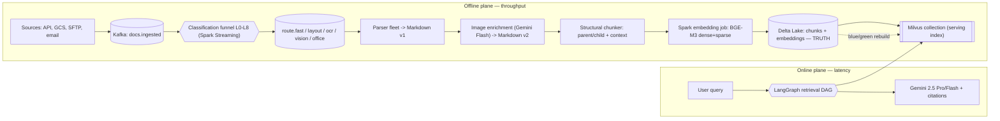
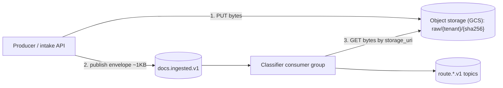
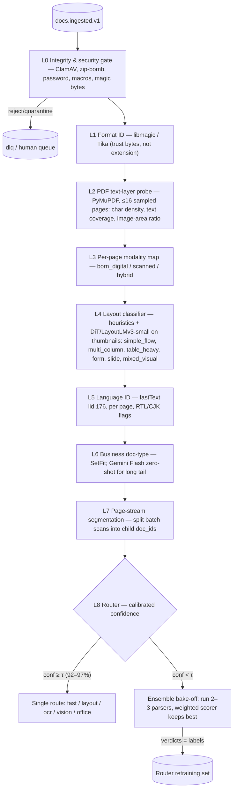
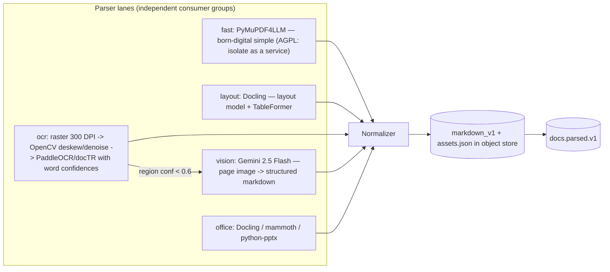
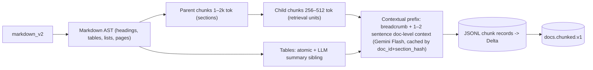
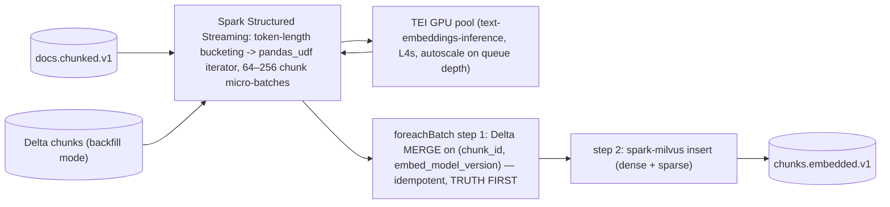
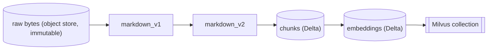
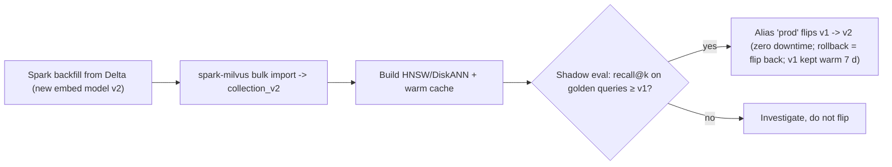
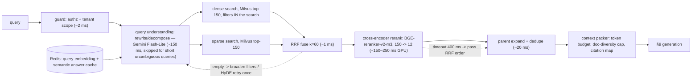

# Cardinal — Distributed Document Intelligence & RAG Platform

**Architecture v1.0 · 2026-07-06 · Open-source-first · Spark + Kafka + LangGraph + Vertex AI (Gemini)**

> Diagrams below are Mermaid — they render on GitHub, GitLab, VS Code, and Obsidian. A companion HTML edition with full layered SVG diagrams ships alongside this file (print-to-PDF friendly).

**Contents:** [1. System overview](#1-system-overview) · [2. Kafka backbone](#2-kafka-event-backbone) · [3. Classification internals](#3-document-classification--internal-architecture) · [4. Parser fleet](#4-parser-fleet) · [5. Enrichment & chunking](#5-image-enrichment--chunking) · [6. Spark embedding](#6-embedding-at-scale-with-spark) · [7. Storage & lineage DAG](#7-storage-lakehouse--the-loading-dag) · [8. Retrieval DAG](#8-online-retrieval--the-langgraph-dag) · [9. Generation](#9-generation-grounding--citations) · [10. Orchestration & eval](#10-orchestration-observability--evaluation) · [11. Edge cases](#11-edge-case--failure-mode-matrix) · [12. Decisions & roadmap](#12-technology-decisions--build-roadmap)

---

## 1. System overview

Two planes with different physics, joined by the lakehouse:

- **Offline plane (throughput):** Kafka + Spark move millions of documents through classify → parse → enrich → chunk → embed → index. Optimize for docs/hour and cost/doc.
- **Online plane (latency):** LangGraph + Milvus + Gemini answer questions in < 2.5 s P95 to first token. Spark never sits on this path.

**Governing principles**

1. **Claim-check messaging** — Kafka carries ~1 KB envelopes; bytes live in object storage.
2. **Delta Lake is the source of truth** — Milvus is a rebuildable serving index.
3. **Calibrated-confidence routing** — one parser when sure, an ensemble bake-off when not.
4. **Everything replayable** — every artifact keyed by `(doc_id, stage, version)`.
5. **Idempotent consumers** — at-least-once delivery + dedupe keys = effectively exactly-once.
6. **One `trace_id` end to end** — from upload event to generated answer, in LangSmith + OTel.



**SLOs:** born-digital → searchable P95 < 4 min · OCR-heavy P95 < 30 min · query → first token P95 < 2.5 s · routing precision ≥ 98% on golden set.

---

## 2. Kafka event backbone

**Claim-check pattern:** producers upload bytes to object storage first, then publish a small Avro envelope. Brokers never see file bytes — a 2 GB scan and a 20 KB memo cost the same to move through Kafka.



**Envelope contract (Avro, schema registry):**

```json
{
  "doc_id": "uuidv7", "tenant_id": "t_...", "trace_id": "otel-hex",
  "storage_uri": "gs://cardinal-raw/t_.../sha256", "sha256": "...",
  "size_bytes": 1048576, "mime_declared": "application/pdf",
  "source": "api|gcs|sftp|email", "received_at": "ts", "schema_version": 1
}
```

**Topic map**

| Topic | Partitions | Purpose |
|---|---|---|
| `docs.ingested.v1` | 24 | Entry point; key = doc_id |
| `docs.classified.v1` | 24 | Funnel verdict + routing decision |
| `route.fast.v1` | 12 | Born-digital, simple flow |
| `route.layout.v1` | 24 | Complex layout / tables (Docling) |
| `route.ocr.v1` | 48 | Scanned — widest lane, slowest work |
| `route.vision.v1` | 12 | Vision-LLM escalations |
| `route.office.v1` | 12 | DOCX / PPTX / TXT |
| `docs.parsed.v1` → `docs.chunked.v1` → `chunks.embedded.v1` (48) → `docs.indexed.v1` | — | Stage hand-offs |
| `retry.{stage}.v1` / `dlq.{stage}.v1` | — | Bounded retries then dead-letter with reason |
| `docs.state` | compacted | Latest lifecycle state per doc_id |

**Semantics:** at-least-once delivery; consumers dedupe on `(doc_id, stage, sha256)`; transactional outbox at intake so DB row + Kafka publish commit atomically; KEDA autoscales consumer groups on lag; RF=3, `acks=all`, `min.insync.replicas=2`.

---

## 3. Document classification — internal architecture

**Terminology fix baked into the design:** a *confusion matrix* is an **offline** evaluation artifact — you compute it monthly on a ~2k-doc labeled golden set to measure the router and pick thresholds. At **runtime** the signal is a **calibrated confidence score** (temperature-scaled softmax). Per route, threshold **τ** is chosen from the golden set so that routing precision ≥ 98%.

- `confidence ≥ τ` → **single-parser route** (92–97% of traffic — cheap path)
- `confidence < τ` → **ensemble bake-off**: fan out 2–3 candidate parsers, score every output, keep the best. Verdicts are logged as fresh training labels → the router improves monthly (flywheel).



**Signals per layer (cost-ordered — cheap filters first):**

| Layer | Tool | Signal | Cost/doc |
|---|---|---|---|
| L0 | ClamAV, libarchive, PyMuPDF | infected, zip-bomb ratio, `needs_pass`, macros | ~5 ms |
| L1 | libmagic / Tika | true MIME | ~1 ms |
| L2 | PyMuPDF sampled pages | text coverage %, image-area ratio | ~30 ms |
| L3 | derived from L2 per page | modality map | ~0 |
| L4 | heuristics + DiT-small on 224px thumbnails | layout class | ~80 ms GPU-batched |
| L5 | fastText lid.176 | language(s), script direction | ~2 ms |
| L6 | SetFit / Gemini Flash | invoice, contract, report, slide-deck, form, email, … | ~10 ms / ~$0.0002 |
| L7 | header+visual boundary model | child doc boundaries | scan lane only |
| L8 | logistic router, temperature-scaled | route + confidence | ~1 ms |

**Router policy (modality × layout → lane):**

| Modality | Layout | Route | Primary parser |
|---|---|---|---|
| born_digital | simple_flow | fast | PyMuPDF4LLM |
| born_digital | multi_column / table_heavy | layout | Docling |
| scanned | any | ocr | PaddleOCR / docTR (+Docling layout) |
| any | mixed_visual / form (hard) | vision | Gemini 2.5 Flash |
| office | — | office | Docling / mammoth / python-pptx |
| hybrid | per-page | split by modality map | mixed lanes, merged after |

**Ensemble bake-off scorer (weighted):** extraction yield 0.25 · structure fidelity 0.25 · gibberish rate 0.20 (inverted) · table integrity 0.20 · reading-order sanity 0.10. Deterministic metrics, no LLM judge needed at this stage.

> **Licensing note:** John Snow Labs *Spark NLP Visual/OCR* (the "Spark NLP LayoutLM vision" idea) is **commercial**. Same capability open-source: Docling's built-in layout + TableFormer models, or DiT/LayoutLMv3/docTR/PaddleOCR distributed over Spark with `pandas_udf`. LlamaParse is a **hosted paid** service (LlamaIndex the framework is OSS) — excluded by the open-source-first rule. Note LangChain/LlamaIndex are frameworks, not parsers.

---

## 4. Parser fleet

Five lanes, one output contract. Every lane ends at the **Normalizer**, which emits `markdown_v1` + `assets.json` (extracted images) + per-page parser/confidence metadata.



**Parser comparison**

| Parser | License | Best at | Role |
|---|---|---|---|
| **Docling** | MIT | Layout, tables, reading order | **Primary** (layout + office lanes) |
| PyMuPDF4LLM | AGPL-3.0 | Speed on born-digital | Fast lane (service-isolated for AGPL hygiene) |
| pdfplumber | MIT | Ruled tables, coordinates | Bake-off challenger |
| PaddleOCR / docTR | Apache-2.0 | Scans, word confidences | OCR lane |
| Tesseract | Apache-2.0 | Ubiquity | OCR fallback |
| Unstructured | Apache-2.0 | Long-tail formats | Office/edge fallback |
| Gemini 2.5 Flash (vision) | managed | Handwriting, stamps, chaotic layouts | Vision lane + escalations |
| LlamaParse | hosted/paid | — | **Excluded** (open-source-first) |

**Markdown v1 contract:** ATX headings mirroring detected hierarchy · GFM tables · page anchors as HTML comments `<!-- page: 12 -->` (this is what makes page-level citations possible at answer time) · image refs like `` — never base64 · per-page `parser` + `confidence` in front-matter.

---

## 5. Image enrichment & chunking

**Enrichment (markdown_v1 → markdown_v2):** an image triage step classifies every asset —

- contains text → OCR the crop, inline the text
- chart / diagram / form / photo → **Gemini 2.5 Flash** with a JSON-schema prompt (temp 0.1) returns `{type, caption, data_summary, entities}` → injected under the image ref as a described block
- decorative (logos, rules) → skipped

`markdown_v2` is stored back to object storage — the permanent, human-readable, fully-enriched representation of the document.

**Chunking (structure-aware, not fixed-size):**



- **Parent/child hierarchy:** search on small chunks (precision), hand parents to the LLM (context).
- **Contextual prefixes** (Anthropic-style contextual retrieval): ~35–50% fewer retrieval misses in published evals; caching by `(doc_id, section_hash)` keeps Gemini cost near-zero on re-runs.
- **Overlap:** 0 when structure is real; 15% only for flat-text fallback.

**Per-doc-type strategy**

| Doc type | Strategy |
|---|---|
| Contracts / legal | Clause-level chunks; never split a clause; article breadcrumbs |
| Presentations | One chunk per slide + speaker notes attached |
| Table-heavy reports | Tables atomic; summary sibling embedded; full table in payload |
| Forms | Key-value groups as chunks |
| Email threads | Per-message chunks, thread breadcrumb |
| Flat text (TXT) | The only place semantic/recursive splitting is used |

---

## 6. Embedding at scale with Spark

One Structured Streaming codebase serves **two sources**: live Kafka (`docs.chunked.v1`) and Delta backfill reads (re-embedding, new tenants, model migrations).



Controls: `maxOffsetsPerTrigger` backpressure · key salting for giant docs · truncate-and-flag on context overflow · Delta written **before** Milvus so the index is always rebuildable from truth.

**Embedding model choice**

| Model | License | Dims / ctx | Verdict |
|---|---|---|---|
| **BGE-M3** | MIT | 1024 / 8192 | **Primary** — dense + sparse + ColBERT in one pass → hybrid retrieval without a second model |
| ModernBERT-embed (nomic) | Apache-2.0 | 768→256 Matryoshka / 8192 | Fast English-only alternative; your "ModernBERT" instinct, productionized |
| multilingual-e5-large | MIT | 1024 / **512** | Context window too small for parent chunks |
| Vertex gemini-embedding | managed | 3072 / 8192 | Zero-ops option; cost crosses over past ~10M chunks |
| SigLIP (optional) | Apache-2.0 | image+text | Separate collection for visual search if needed later |

---

## 7. Storage, lakehouse & the loading DAG

**Lineage DAG — every artifact keyed `(doc_id, stage_version)`, replayable from any node:**



**Who stores what**

| Store | Holds | Why |
|---|---|---|
| Object storage (GCS) | raw bytes, md_v1/v2, assets | Immutable; coldline after 90 d |
| Postgres | doc registry, states, **deletion ledger** | Transactions; GDPR erasure driver |
| **Delta Lake** | chunks + embeddings + eval logs | **Truth**; time travel; MERGE idempotency |
| **Milvus** | serving vectors (dense+sparse), tenant partitions, scalar filters | Distributed ANN at query time |
| OpenSearch (optional) | BM25 keyword | Only if Milvus sparse proves insufficient — pick **one** sparse story |

**Blue/green bulk load (the "DAG concept while loading"):**



**Index tuning:** < 20M vectors → HNSW M=16, efConstruction=200 · 20–100M → + SQ8 quantization · > 100M → DiskANN. Vector DB call: **Milvus** primary (Spark connector, tenant partitions, aliases); Qdrant if the ops team is small; pgvector for dev only.

---

## 8. Online retrieval — the LangGraph DAG

**Honest correction:** Spark is the wrong engine for *online* retrieval — job scheduling alone exceeds the whole query budget. The distributed muscle at query time is **Milvus's own query nodes**; the thing you orchestrate is the reasoning DAG around the search, and that is exactly **LangGraph** (the retrieval DAG you asked for). Spark keeps retrieval's *offline* side: nightly recall@k evals by replaying logged queries, retrieval-log analytics (zero-hit mining, hot docs), and the §7 reindex jobs.



**Latency budget (P95 ≤ 2.5 s to first token):** guard 2 → rewrite 150 → hybrid ∥ 90 → RRF 1 → rerank 250 → expand 20 → pack 5 → Gemini TTFT 700–1200 ms. Levers in order: skip-rewrite gate, rerank depth 150→50 under load, semantic answer cache, Flash-vs-Pro difficulty router.

> **LangGraph vs Google ADK:** both express agent graphs and speak Gemini. LangGraph wins here on typed state, checkpointing, and LangSmith tracing; the node functions are plain Python and port to ADK cleanly if the team standardizes there. Don't run both orchestrators in one service.

---

## 9. Generation, grounding & citations

- **Prompt contract:** answer *only* from provided context; every claim carries `[chunk_id]`; "not found in the provided documents" beats improvisation; page anchors from §4 turn markers into "MSA 2024, p. 12" in the UI.
- **Model tiering (Vertex):** Gemini **2.5 Pro** for multi-chunk synthesis; **2.5 Flash** for lookups + all pipeline utility calls. A difficulty router sends 60–75% of traffic to Flash at ~10× lower cost.
- **Groundedness gate:** Flash-Lite NLI-style check per sentence vs cited chunks; unsupported ratio > 15% → one constrained regeneration → else extractive fallback (top reranked chunks verbatim, flagged). Nothing ungrounded ships silently.
- **Streaming UX:** citation chips resolve live; sources panel links to the original page image, so users verify against the *document*, not the Markdown. Feedback buttons log to Delta for §10.

---

## 10. Orchestration, observability & evaluation

Three orchestrators, three jobs — one tool doing everything is how systems become undebuggable:

| Concern | Owner | Why |
|---|---|---|
| Streaming doc flow, stage → stage | **Kafka** choreography | Backpressure, replay, per-stage scaling for free |
| Backfills, reindexes, nightly evals | **Dagster** (or Airflow) | Lineage-DAG walks with dependencies/retries; Dagster assets map 1:1 to §7 |
| Per-query reasoning | **LangGraph** | Millisecond-scale, stateful, branching |
| Human/business workflows (review queues, approvals) | **Camunda 8** | Subscribes to `docs.indexed` / `dlq.*`; never drives the data plane |

**Observability:** **LangSmith** traces every LLM-touching path (vision parses, captions, retrieval DAG, generation, groundedness) under the single `trace_id` minted at ingestion. **OTel → Prometheus/Grafana** covers the spine: consumer lag per topic, stage latency histograms, DLQ rates, GPU utilization (OCR/TEI/rerank pools), Milvus P99. Alert on lag *growth rate* and DLQ *ratio*, not raw counts.

**Evaluation program**

| Layer | Method | Cadence |
|---|---|---|
| Classifier/router | Confusion matrix on ~2k golden docs; threshold recalibration; bake-off flywheel retraining | Monthly + parser upgrades |
| Parsing | Bake-off scorer on 1% random sample of high-confidence docs (silent-regression tripwire) | Continuous |
| Retrieval | recall@k / nDCG via Spark replay of logged queries; zero-hit mining | Nightly |
| End-to-end | RAGAS / DeepEval (faithfulness, relevancy, context precision) + LangSmith annotation queues | Weekly + pre-release |
| Rollouts | New parser/model shadows 5% traffic; promote on parity | Every release |

---

## 11. Edge-case & failure-mode matrix

Every row has an owner stage, deterministic behavior, and an observable outcome — nothing fails silently.

| Stage | Edge case | Handling |
|---|---|---|
| Ingestion/L0 | Zero-byte / truncated file | Reject; `docs.state=rejected(reason)`; source notified |
| Ingestion/L0 | Password-protected PDF | Quarantine; Camunda human task for credentials; re-queue on supply |
| Ingestion/L0 | Corrupted container | One repair pass (`qpdf`/`mutool clean`) → else DLQ with reason |
| Ingestion/L0 | Zip bomb (ratio > 100:1) | Hard reject; security event |
| Ingestion/L0 | Macro-enabled Office | Strip macros; security-review flag |
| Ingestion/L0 | Extension ≠ magic bytes | Magic bytes win; mismatch logged |
| Ingestion | Huge file (multi-GB / 10k pages) | Page-range sharding into `(doc_id, page_range)` child units; parallel parse; ordered reassembly |
| Ingestion | Duplicate upload (same sha256) | Dedupe: link doc_id to existing artifacts; skip pipeline |
| Ingestion | Re-upload, new hash | New version; supersede pointer; old vectors tombstoned after grace period |
| Classification | Hybrid scanned+digital doc | L3 per-page modality map; page groups to different lanes; merged in order |
| Classification | Multi-doc batch scan | L7 splits into child doc_ids with parent linkage |
| Classification | Mixed / RTL / CJK language | Per-page fastText; RTL OCR config; PaddleOCR multilingual |
| Classification | Low confidence everywhere | Bake-off → still below floor → human review; verdict feeds retraining |
| Parsing/OCR | Skewed / rotated scans | OpenCV deskew + Tesseract OSD orientation |
| Parsing/OCR | Low DPI (<150) | Upscale; quality flag flows to chunk metadata |
| Parsing/OCR | Handwriting | OCR confidence collapse → vision lane; low-trust flag retained to answer time |
| Parsing/OCR | Stamps / watermarks / overprint | Low-conf regions cropped → Gemini vision per region |
| Parsing/OCR | Tables spanning pages | Stitch when header row repeats across boundary; keep per-fragment page anchors |
| Parsing/OCR | Repeating headers/footers | Cross-page repetition detector strips from body, keeps in metadata |
| Parsing/OCR | TOC / blank / separator pages | Excluded from chunking; retained for citable page numbers |
| Parsing/OCR | Parser hang/crash | Per-lane timeouts (60 s fast → 30 min OCR); one retry on alternate parser; DLQ |
| Enrich/chunk | Missing image asset | Skip caption; integrity error logged |
| Enrich/chunk | Gemini caption refusal/safety block | Deterministic fallback caption from OCR text; flagged |
| Enrich/chunk | Section > parent max | Recursive split with synthesized sub-headings |
| Enrich/chunk | Boilerplate-only chunks | Hash-frequency filter drops pre-embedding |
| Embed/index | Chunk exceeds embedder context | Truncate-and-flag; giant tables embed summary sibling, full table in payload |
| Embed/index | GPU OOM / TEI saturation | Length bucketing; smaller retry batches; KEDA scale-out |
| Embed/index | Milvus partial insert failure | Delta is truth → nightly anti-entropy diff re-pushes missing chunk_ids |
| Embed/index | Hot tenant / partition skew | Key salting; per-tenant ingest quotas |
| Ops | Consumer-lag spike | KEDA scale-out; alert on lag growth rate; OCR priority tiers shed gracefully |
| Ops | Poison message loop | Retry topics with attempt cap → DLQ + alert; replayer tool after fix |
| Ops | Gemini 429 / quota | Client token buckets; backoff; Provisioned Throughput in prod; degrade Pro→Flash |
| Ops | Vision-lane cost runaway | Per-tenant daily budget caps; sampled escalation audits |
| Ops | GDPR erasure | Deletion ledger drives Delta delete+vacuum, Milvus delete-by-doc_id, object purge, cache bust; nightly sweep verifies |
| Ops | Embedding model migration | §7 blue/green from Delta; `embed_model_version` field forbids mixed collections |

---

## 12. Technology decisions & build roadmap

| Area | Choice | Runner-up | Deciding factor |
|---|---|---|---|
| Event bus | **Kafka** (claim-check) | Pub/Sub | Replay, compacted state, KEDA, no vendor coupling |
| Distributed compute | **Spark Structured Streaming** | Flink / Ray | One engine for streaming + backfill + eval; pandas_udf GPU; spark-milvus |
| Primary parser | **Docling** (MIT) | pdfplumber challenger | Layout + TableFormer without commercial licenses |
| OCR | **PaddleOCR / docTR** | Tesseract fallback | Word confidences drive vision escalation |
| Vision + utility LLM | **Gemini 2.5 Flash** | — | Structured JSON, cost, one platform with Pro |
| Embeddings | **BGE-M3** | ModernBERT-embed / Vertex embedding | Dense+sparse one pass; 8k ctx; MIT |
| Truth store | **Delta Lake** | Iceberg | Time travel + MERGE; Milvus stays disposable |
| Vector DB | **Milvus** | Qdrant | Query-node scale-out, partitions, Spark import, aliases |
| Retrieval orchestration | **LangGraph** + LangSmith | Google ADK | Typed state, checkpoints, tracing; nodes stay portable |
| Batch orchestration | **Dagster** | Airflow | Asset model mirrors lineage DAG |
| Reranker | **BGE-reranker-v2-m3** | Cohere API | Self-hosted, multilingual, ~200 ms at depth 150 |

**Roadmap**

| Phase | Scope | Exit criteria |
|---|---|---|
| **P0 — Walking skeleton** (wks 1–4) | Kafka claim-check → L0–L2 → Docling-only → simple chunks → BGE-M3 → single Milvus collection → dense-only LangGraph → Gemini + citations | One PDF end-to-end, trace_id visible in LangSmith |
| **P1 — Quality** (wks 5–9) | Full L0–L8 + calibrated router, OCR + vision lanes, bake-off, enrichment, parent/child + contextual chunks, hybrid + rerank | Routing precision ≥ 98%; recall@10 ≥ 0.85 |
| **P2 — Scale & hardening** (wks 10–14) | KEDA, DLQ replayer, page sharding, blue/green drill, GDPR sweep, §11 test suite | Load test at target volume inside SLOs |
| **P3 — Optimization** (ongoing) | Difficulty router, semantic caches, flywheel retraining, cost dashboards | Cost/doc and cost/query trending down at stable quality |

**The invariants everything hangs on:** bytes stay in object storage · truth lives in Delta · indexes are disposable · every stage is replayable · every LLM call is traced. Get these in at P0 and parsers, embedders, even the vector DB can be swapped later without a rewrite.
