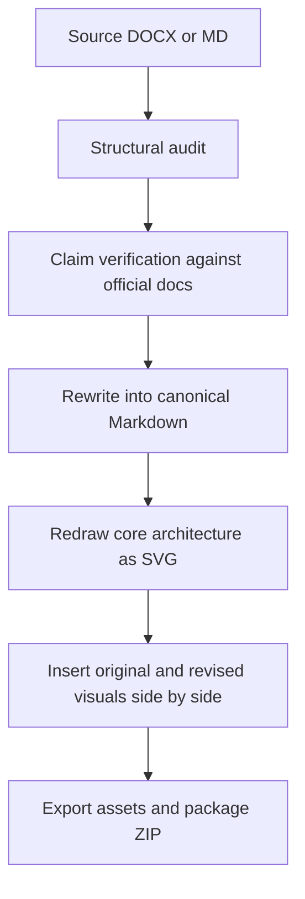
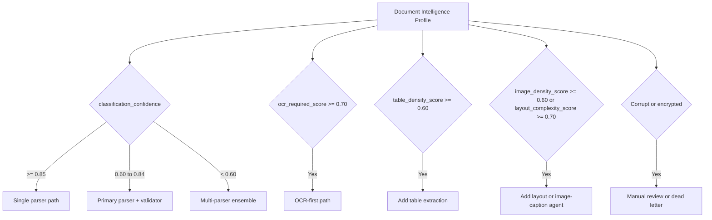
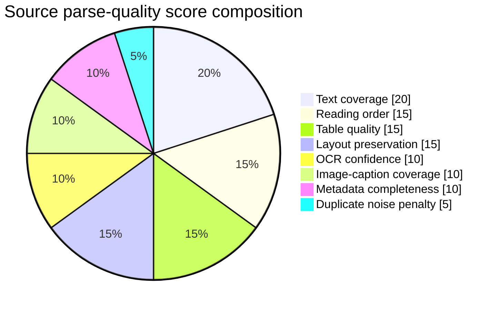

# Research Report on Rewriting and Modernizing the Enterprise RAG Architecture Document

## Executive summary

The material currently available is substantial enough to begin a serious rewrite, but the source package is not yet exactly what the brief describes. The primary narrative source available in this conversation is a 27-page DOCX, **not** a Markdown file, and its parsed text shows repeated section patterns, missing extracted figure renders, and a strong technical core that would benefit from consolidation, sharper sourcing, and better Markdown-native presentation. The document already contains a layered enterprise RAG architecture, agent-by-agent workflows, routing thresholds, parse-quality scoring, sample Markdown/JSON output, and deployment guidance, which makes it a strong candidate for conversion into a cleaner architecture brief or implementation guide. fileciteturn3file0 fileciteturn6file0 fileciteturn6file2

From a standards and tooling perspective, the requested deliverables are feasible. CommonMark supports headings, fenced code blocks, images, and raw HTML; GitHub-flavored Markdown supports tables and Mermaid diagrams; Mermaid can represent flowcharts, ER diagrams, Gantt/timeline views, and architecture-style diagrams; and Mermaid CLI can export SVG and PNG output and even transform Markdown files that contain Mermaid blocks into Markdown that references generated SVG assets. citeturn4view6turn4view7turn4view8turn18view1turn4view1turn6view3turn14view1turn17view1turn17view2

The most important editorial conclusion is that the source should **not** be rewritten section-by-section in its current order. It reads more like a long-form solution memo than like an exportable Markdown document. A good revision should collapse repetitive agent sections into a smaller number of architecture chapters, maintain the strongest examples, move product-specific claims into evidence-backed notes, and rebuild the figure strategy around relative asset paths, reliable captions, alt text, and side-by-side comparison blocks. The best final product would be a professional architecture README or white-paper-style Markdown package with an executive summary, architecture overview, component deep dives, retrieval/verification path, operational concerns, and appendices for schemas and event contracts. fileciteturn3file0 fileciteturn7file2 fileciteturn6file2 citeturn8view1turn8view2turn4view4turn4view5

## Source package and readiness

The current source inventory appears to include one primary narrative document and several image candidates that could serve as the “supplied architecture image,” even though the original `.md` file has not yet been explicitly provided. The DOCX is titled **Multi_Agent_Enterprise_RAG_Architecture_3.docx**. Separate architecture-image candidates exist in the user’s file set, including a layered platform diagram, an orchestration-focused system diagram, and a compact platform architecture PNG. That means the rewrite can begin from the available material, but a true “original vs revised Markdown” comparison will remain approximate until the original `.md` source is supplied or the DOCX is declared authoritative. fileciteturn6file0 fileciteturn6file6 fileciteturn6file8 fileciteturn6file12

filenavlist6:0current narrative source document containing the 27-page enterprise RAG architecture write-up and its section-based agent workflows6:6candidate polished layered platform diagram suitable for use as the user-supplied architecture image in the revised Markdown package6:8alternative orchestration-focused image with stronger emphasis on normalization, retrieval, and answer verification6:12compact architecture PNG that is especially suitable for pairing side-by-side with a newly redrawn SVG diagram

A practical readiness assessment is below.

| Asset class | Current status | Research conclusion |
|---|---|---|
| Narrative source | Available as DOCX | Usable for deep rewrite, but not yet the promised `.md` source. fileciteturn6file0 |
| Architecture image | Likely available via candidate PNGs | Enough to prototype side-by-side layout now, but the user should confirm which image is the authoritative “supplied architecture image.” fileciteturn6file6 fileciteturn6file8 fileciteturn6file12 |
| Embedded figures in source narrative | Incomplete in parsed DOCX view | Several figure slots in the document show unavailable embedded-image extraction, so the figure program should be rebuilt rather than copied blindly. fileciteturn3file0 |
| Quantitative data for charts | Limited | The source contains threshold rules and scoring weights, but not benchmark datasets; visuals should therefore be explanatory, not empirical. fileciteturn3file0 fileciteturn7file5 |
| Final ZIP package | Feasible | Straightforward once the final Markdown, chosen image, and exported SVG/PNG assets are assembled. citeturn17view1turn17view2 |

## Structural and editorial assessment

The source document is content-rich but structurally over-expanded. It begins with a high-level architecture statement, then proceeds through design layers, an agent catalog, and a long sequence of nearly uniform component sections such as ingestion, classification, parser routing, parser ensemble, quality judging, Markdown building, JSON building, chunking, embedding, vector writing, query planning, domain retrieval, fusion, reranking, verification, synthesis, observability, deployment, and final boundary recommendations. That organization is logically sound, but the repeated “Purpose / Figure / Workflow / Output” pattern makes the text read like a slide-deck transcript rather than a publishable Markdown architecture guide. fileciteturn3file0 fileciteturn6file0 fileciteturn7file0 fileciteturn7file2 fileciteturn6file2

The strongest part of the source is its conceptual separation between deterministic large-scale processing and selective LLM reasoning. Early pages explicitly argue for deterministic distributed systems for heavy processing, specialized agents for orchestration, and LLMs only for reasoning, enrichment, verification, and final answers. That thesis is strong and should remain the anchor of the rewrite. What should change is the presentation: the opening should become a short executive summary, a scope statement, and a single architecture overview before moving into grouped subsystems. fileciteturn3file0

The weakest part of the source is navigability. In Markdown, long serial numbering alone is not enough. Better navigation comes from a heading hierarchy, a clear section taxonomy, and predictable content blocks. GitHub’s Markdown rendering automatically exposes an outline when a file has two or more headings, and GitHub’s syntax guidance also favors simple headings, fenced code blocks, images, and tables for readable technical documents. citeturn8view2turn8view3turn4view1turn8view1

A more effective editorial model is shown below.



The section-level restructuring should look like this.

| Original source area | What it does well | What is inefficient now | Recommended revised section |
|---|---|---|---|
| Title, introductory thesis, whole-project architecture | Establishes scope and architectural stance | Too little context for business readers before deep technical expansion | **Executive summary** plus **Architecture overview** |
| Main design layers and agent catalog | Gives a useful system inventory | Tables are dense and partly repetitive with later sections | **System context and component map** |
| Ingestion through parser quality judge | Strong pipeline logic | Too many micro-sections for one subsystem | **Ingestion and document intelligence pipeline** |
| Markdown builder, JSON builder, chunking, embedding, vector write | Clear data-product progression | Split into too many narrow chapters | **Knowledge normalization and indexing** |
| Query planner through answer synthesis | Excellent retrieval and verification narrative | Could be one coherent query-time chapter | **Retrieval, verification, and answer generation** |
| Observability, deployment, boundaries | Important closing material | Arrives too late and feels appended | **Operations, governance, and deployment** |
| Examples and event payloads | Very useful | Buried in middle pages | **Appendices for schemas, events, and scoring rules** |

## Technical accuracy and claim verification

The core architectural choices in the source are broadly defensible and align well with primary documentation. Kafka’s official introduction describes event streaming as capturing, storing, routing, and processing streams of events, and notes that Kafka combines publishing/subscribing, durable storage, and event processing. Kafka also documents topics as partitioned for scalability, with new events appended to partitions. Spark’s Structured Streaming Kafka guide shows direct read and write integration against Kafka and exposes topic, partition, offset, timestamp, and optional headers in the source schema. Those official details support the source document’s use of Kafka plus Spark for event-driven background document processing. citeturn13view0turn13view2turn12view0

The document’s document-intelligence and normalization path is also on solid ground. Docling’s official documentation lists support for PDF, Office formats, Markdown, HTML, CSV, and common image types as inputs, and lists Markdown and JSON among its supported output formats. The docs also show figure export, table export, multimodal export, chunking, and RAG-oriented integrations. That means the source document’s emphasis on canonical Markdown plus structured JSON is technically well aligned with the platform capabilities it names. citeturn13view3turn13view5turn11view5turn11view6

The orchestration layer is likewise substantially supportable. LangGraph’s official overview describes it as an orchestration runtime focused on durable execution, streaming, human-in-the-loop, and persistence, while LangSmith’s observability docs explicitly cover tracing, viewing traces, monitoring performance, and tracing a RAG application. Google ADK’s official site describes ADK as an open-source framework for building, debugging, and deploying reliable AI agents at enterprise scale; its documentation also highlights graph-based workflows, precise control with nodes and edges, and growth into multi-agent orchestration and deployment. These official sources support the source document’s broad claim that LangGraph and ADK are appropriate building blocks for complex agent orchestration. citeturn11view0turn11view1turn13view8turn11view2turn11view3turn13view6

That said, several product-specific statements in the source should be softened or re-sourced in the rewrite. Examples include comparative judgments about certain parsers being appropriate only for prototyping, highly specific deployment-path claims, and some vendor preference language that reads more like architectural opinion than verifiable fact. Those passages should either be supported with primary documentation or rewritten as explicit recommendations, trade-offs, or selection criteria rather than declarative claims. fileciteturn3file0 fileciteturn7file3

A related issue is evidence discipline. The current source contains formulas and threshold logic, which are useful, but they are architectural rules, not measured results. For example, it specifies parser-routing thresholds and a weighted parse-quality score, but it does not provide an empirical benchmark dataset, experimental setup, or measured outcomes. In the revised Markdown, any charts derived from these values should be labeled as **design heuristics** or **policy logic**, not as production performance evidence. fileciteturn3file0 fileciteturn7file5

## Recommended Markdown and visual design

The revised Markdown should target portability first and renderer-specific embellishment second. CommonMark formally defines headings, fenced code blocks, images, and raw HTML; GitHub’s documentation adds practical guidance for generating an outline from headings, creating tables, inserting images with alt text, and embedding Mermaid diagrams inside fenced code blocks. This means the safest architecture for the final file is: native Markdown for prose and code; GFM tables for comparison matrices; Mermaid for editable diagrams; and carefully contained raw HTML only where Markdown has no native layout primitive, such as side-by-side images. citeturn4view6turn4view7turn4view8turn8view2turn4view1turn8view1turn6view3

One subtle but important implementation detail comes from CommonMark’s handling of raw HTML blocks. A `<table>` block is valid raw HTML in CommonMark, but HTML blocks started by `<table>` are sensitive to blank lines; the spec shows that blank lines can terminate the HTML block sooner than many authors expect. In practice, that means your side-by-side image block should be kept compact with no empty lines inside the table structure. That is the best standards-based way to make image comparison work in Markdown when the renderer allows raw HTML. citeturn18view0turn18view3

A robust side-by-side pattern looks like this:

```html
<table>
  <tr>
    <td align="center" width="50%">
      
      <p><em>Figure A. Original architecture image supplied by the user.</em></p>
    </td>
    <td align="center" width="50%">
      
      <p><em>Figure B. Revised architecture diagram redrawn in SVG.</em></p>
    </td>
  </tr>
</table>
```

That pattern is consistent with Markdown’s image model and accessibility guidance. CommonMark maps image descriptions to the HTML `alt` attribute, GitHub describes alt text as a short text equivalent of the information in the image, and W3C’s image tutorial and WCAG 2.2 require text alternatives that serve the equivalent purpose of non-text content. citeturn4view8turn8view1turn4view4turn4view5

For the document structure itself, this is the recommended top-level outline.

| Revised section | Purpose |
|---|---|
| Executive summary | Give decision-makers a one-page read of the architecture, trade-offs, and outcomes |
| Architecture overview | Present the full platform and the role of deterministic systems versus LLM reasoning |
| Ingestion and document intelligence | Cover discovery, classification, routing, parsing, and quality control |
| Knowledge normalization and indexing | Explain Markdown/JSON outputs, chunking, embeddings, vector writes, and metadata |
| Retrieval, verification, and answer generation | Explain query planning, domain retrieval, fusion, reranking, evidence verification, and synthesis |
| Operations and deployment | Cover security, ACLs, observability, lineage, reliability, and deployment boundaries |
| Appendices | Keep examples, schemas, scoring formulas, and event payloads out of the narrative flow |

## Diagram and asset production strategy

The source already contains enough logic to generate at least two strong explanatory charts even before any empirical metrics are supplied. One is a routing-policy diagram based on the parser router thresholds. Another is a score-composition chart based on the parse-quality weights. Because Mermaid is Markdown-native on platforms such as GitHub and can also be exported through Mermaid CLI, these visuals can remain editable in the Markdown source while also being exported as SVG and PNG assets for packaging. GitHub documents Mermaid support in fenced code blocks, Mermaid documents the supported diagram families, and Mermaid CLI documents SVG/PNG/PDF generation plus Markdown transformation. citeturn6view3turn14view1turn17view1turn17view2

A first explanatory Mermaid visual should encode the routing logic from the source.



This chart is directly grounded in the source’s routing thresholds and should be captioned as **design-time policy logic**, not performance data. fileciteturn3file0

A second explanatory visual can convert the parse-score formula into a Mermaid chart.



Again, this is not an observed benchmark. It is a visualization of the architecture’s own weighting policy. The source makes that explicit in the scoring formula. fileciteturn3file0

For the main architecture redraw, the best approach is to create a new master SVG with a smaller number of visual zones than the current source uses: enterprise sources, ingestion, document intelligence, normalization, chunking/indexing, retrieval/answering, cross-cutting governance, and user interaction. The separate PNG candidates already show that the visual language of the project is converging on exactly those groupings, especially around ingestion, parsing, Markdown/JSON normalization, chunking/embedding, hybrid retrieval, and answer verification. fileciteturn6file6 fileciteturn6file8 fileciteturn6file12

Mermaid is valuable for intermediate editable diagrams, but for the flagship architecture figure I would still recommend a hand-authored final SVG. Mermaid’s own documentation says it renders diagrams in SVG form on the web, and Mermaid CLI can export both SVG and PNG. That makes Mermaid ideal for support figures and reusable source diagrams, while a custom SVG remains better for fine-grained layout, icon placement, and side-by-side visual comparison with the user-provided architecture image. citeturn16view0turn17view1

## Deliverables, blockers, and edit log design

On the evidence available so far, the requested deliverables split into three groups: deliverables that are ready to produce now, deliverables that are ready once the authoritative source files are confirmed, and deliverables that depend on data that does not yet exist in the source. The only meaningful blocker is not technical; it is source certainty. If the DOCX is the authoritative source and one of the discovered PNG files is the intended “supplied architecture image,” then the full package can be produced from the current materials. If the user still intends to provide a separate Markdown original and a different image, then those should supersede the currently found files. fileciteturn6file0 fileciteturn6file6 fileciteturn6file8 fileciteturn6file12

| Deliverable | Status from this research pass | Notes |
|---|---|---|
| Executive summary | Ready | The source already supports a concise executive rewrite. fileciteturn3file0 |
| Rewritten Markdown file | Conditionally ready | Fully feasible from the DOCX, but “original vs revised Markdown” comparison improves if the original `.md` is supplied. fileciteturn6file0 |
| Updated architecture diagram in SVG and PNG | Ready | Supported by Mermaid and SVG-first redraw workflow. citeturn17view1turn17view2turn16view0 |
| Original image placed side-by-side with new diagram | Conditionally ready | One image should be explicitly confirmed as the canonical supplied architecture image. fileciteturn6file6 fileciteturn6file8 fileciteturn6file12 |
| Supporting images and graphs | Ready | Explanatory visuals can be generated now from source formulas and flows; empirical charts require real measured data. fileciteturn3file0 fileciteturn7file5 |
| Asset ZIP | Ready once assets exist | Mermaid CLI and standard packaging make this straightforward. citeturn17view1turn17view2 |
| Brief changelog | Ready | Should be emitted as a compact “what changed and why” appendix. |

A concise changelog model for the final package should look like this.

| Change type | Example entry |
|---|---|
| Structural | Collapsed 20+ serial micro-sections into 6 architecture chapters for readability |
| Editorial | Rewrote prose into idiomatic technical English and normalized heading hierarchy |
| Technical | Reframed unsupported product judgments as trade-offs unless backed by primary docs |
| Visual | Replaced static architecture screenshots with an editable SVG master and support figures |
| Accessibility | Added alt text, captions, relative asset paths, and Markdown-compatible comparison blocks |
| Packaging | Exported Mermaid diagrams to SVG/PNG and assembled a final Markdown-plus-assets ZIP |

The bottom-line research conclusion is straightforward: the source content is good, the current formatting is not. A successful rewrite should preserve the architecture logic, reduce the section count, strengthen primary-source support, rebuild the figure program, and treat Markdown not merely as an export format, but as the primary authoring medium for a maintainable architecture package. fileciteturn3file0 fileciteturn6file2 citeturn4view6turn4view7turn4view8turn4view1turn6view3turn17view2